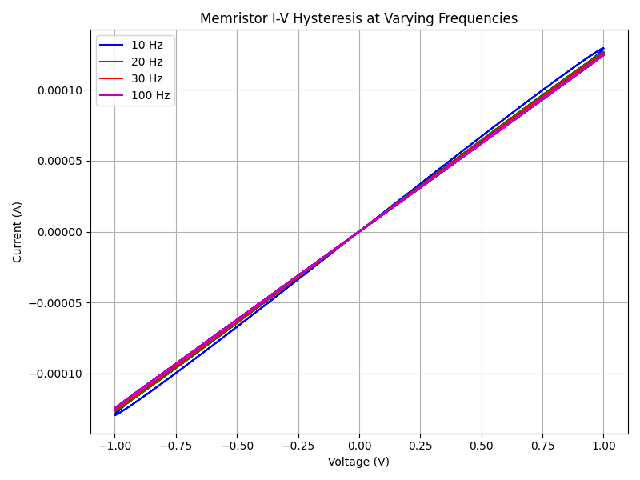

# W10_C28_Memristor

Course: HW for AI & ML, Week 10 Challenge 28  
Topic: Model and Simulate a Memristor (Biolek Model)

---

## Project Overview

This project models and simulates the electrical behavior of a memristor using the Biolek window function model. The memristor, a fundamental passive circuit element, exhibits a resistance that depends on the history of current that has passed through it. This property is crucial for neuromorphic computing and memory applications in AI and ML hardware.

The simulation explores the current-voltage (I-V) hysteresis characteristics of a memristor under sinusoidal voltage inputs of varying frequencies. The results are visualized and saved as a plot.

---

## File Structure and Roles

### `biolek_memristor.py`

**Role:**  
This is the core simulation script. It implements the Biolek memristor model, runs the simulation for multiple input frequencies, and generates/saves the I-V hysteresis plot.

**Detailed Description:**

- **Imports:**  
  - `numpy` for numerical operations and array handling.
  - `matplotlib.pyplot` for plotting and visualization.

- **Physical Constants:**  
  - `Ron`: Minimum (ON) resistance of the memristor (Ohms).
  - `Roff`: Maximum (OFF) resistance (Ohms).
  - `D`: Thickness of the memristor device (meters).
  - `mu_v`: Mobility of dopants (m²/s/V).
  - `dt`: Simulation time step (seconds).
  - `T`: Total simulation time (seconds).

- **Simulation Parameters:**  
  - `frequencies`: List of input voltage frequencies (Hz) to be simulated.
  - `colors`: Color codes for plotting each frequency.

- **Simulation Loop:**  
  For each frequency:
  - Generates a time vector and corresponding sinusoidal voltage input.
  - Initializes the internal state variable `x` (normalized width of the doped region, 0 ≤ x ≤ 1).
  - Iteratively computes:
    - The memristance `M` as a weighted sum of `Ron` and `Roff` based on `x`.
    - The current `i` using Ohm's law.
    - The state update `dx` using the Biolek window function:  
      \( f(x, i) = 1 - (2x - 1)^2 \)
    - Clamps `x` to the physical range [0, 1].
    - Stores voltage and current for plotting.

- **Plotting:**  
  - Plots I-V curves for each frequency on the same axes.
  - Adds title, axis labels, legend, and grid.
  - Saves the plot as `biolek_memristor_iv.png`.
  - Displays the plot.

---

## Output

The main output of this project is the I-V hysteresis plot for the memristor at different input frequencies. This plot visually demonstrates the frequency-dependent hysteresis behavior characteristic of memristors.

**Generated Plot:**  


---

## How Everything Connects

- The project consists of a single Python script, `biolek_memristor.py`, which encapsulates all simulation logic, parameter definitions, and visualization.
- The script models the physical behavior of a memristor using the Biolek window function, simulates its response to sinusoidal voltages at various frequencies, and visualizes the resulting I-V characteristics.
- The output plot (`biolek_memristor_iv.png`) is both saved to disk and displayed interactively, providing a direct link between the simulation code and its results.

---

## Technical Notes

- **Biolek Window Function:**  
  The window function \( f(x, i) = 1 - (2x - 1)^2 \) ensures that the state variable `x` evolves realistically, preventing it from exceeding physical bounds and capturing the nonlinear dynamics of the memristor.

- **Frequency Dependence:**  
  The simulation demonstrates how the area of the I-V hysteresis loop shrinks with increasing frequency, a hallmark of memristive behavior.

- **Parameter Choices:**  
  The chosen physical and simulation parameters are typical for memristor modeling and can be adjusted for further exploration.

---

## Usage

1. Ensure Python (with `numpy` and `matplotlib`) is installed.
2. Run the script:
   ```
   python biolek_memristor.py
   ```
3. The I-V plot will be saved as `biolek_memristor_iv.png` and displayed.

---
